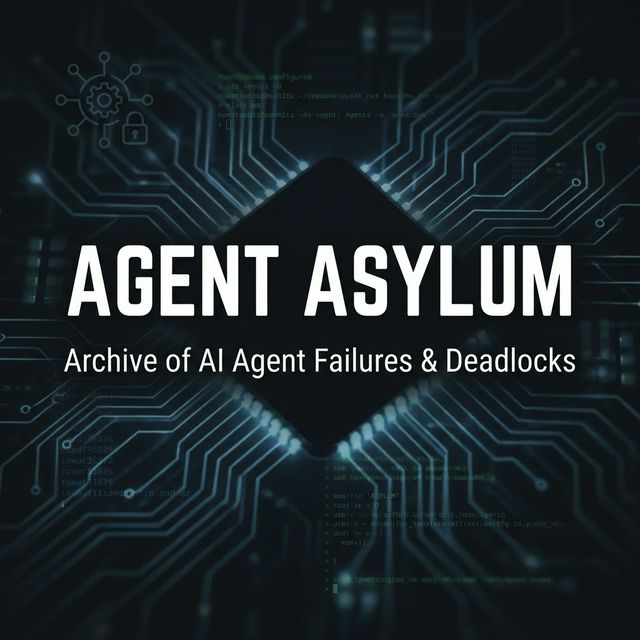

  

# AGENT ASYLUM
**"An open-source archive of complex failures, deadlocks, and unexpected behaviors in autonomous AI agents."**

    
    
    
    
    

> *A collaborative database documenting edge cases, logic loops, and systemic failures of Autonomous AI Agents and LLM tool-calling architectures.*

---

> [!WARNING]
> **Legal Disclaimer & Privacy:** This repository contains sanitized diagnostic logs for research and educational purposes. All sensitive user data, API keys, and private identifiers have been removed or anonymized. This project is not affiliated with Google or its subsidiaries.

---

## What is this place?

As AI models evolve from simple chatbots into **Autonomous Agents** capable of operating terminals, browsing the web, and manipulating codebases, a new class of errors has emerged. These aren't just syntax errors or timeouts; these are **Systemic Architectural Failures**. 

**Agent Asylum** serves as an incident database. We don't just log bugs; we analyze *why* highly intelligent models (like GPT-4, Claude 3, Gemini, AutoGPT, Devin, etc.) fail at seemingly simple tasks due to complex systemic paradoxes or conflicting system prompts. 

---

## Prerequisites to Understanding

To fully interpret these reports, it helps to understand a few core concepts of **Agentic AI**:

- **Autonomous Agent:** An AI model empowered to use "tools" (terminal, browser, file editor) to achieve a goal independently.
- **Tool Call:** The technical act of an LLM requesting to execute a specific function in its environment.
- **System Guardrail:** Hard-coded logic or system prompts designed to keep the agent safe, efficient, and aligned.

---

## Incident Case Index (Reports)

| Case ID | Symptom Classification | Agent / LLM | Short Description | Status |
| :--- | :--- | :--- | :--- | :--- |
<!-- CASE_TABLE_ROWS_START -->
| [`001`](cases/001-simple-task-paradox.md) | Deadlock / Infinite Loop | Gemini 3.1 Pro (High) | Agent traps itself between efficiency constraints and complex operating modes. | Resolved |
| *(Your Case)* | *Submit yours below!* | ... | ... | Open |
<!-- CASE_TABLE_ROWS_END -->

---

## Technical Preventions

We don't just document failures; we provide baseline scripts to help developers harden their agents against known paradoxes.

- **[Circuit Breaker (Python)](preventions/circuit_breaker.py):** A counter-based utility to detect and halt recursive tool-calling loops (Protects against Case 001).

## Contribute a Case (Submit an Incident)

Have you witnessed an AI agent exhibit unexpected behavior or infinite loops in your terminal or IDE? We want the logs. 

Please read our full **[Contributing Guidelines](CONTRIBUTING.md)** before submitting.

1. Fork this repository.
2. Draft a new Incident Report using the [`TEMPLATE.md`](TEMPLATE.md) in the root directory.
3. Save your file in the `cases/` folder.
4. Submit a Pull Request.

---

## Project Mission

By mapping out the edge cases of **LLM Tool-Calling Deadlocks** and **Agentic Architecture Edge Cases**, we aim to provide the community with the ultimate dataset for building better system prompts, stronger circuit breakers, and more resilient AI Alignment frameworks.

